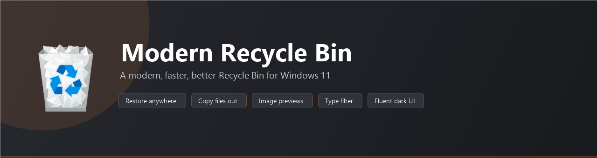
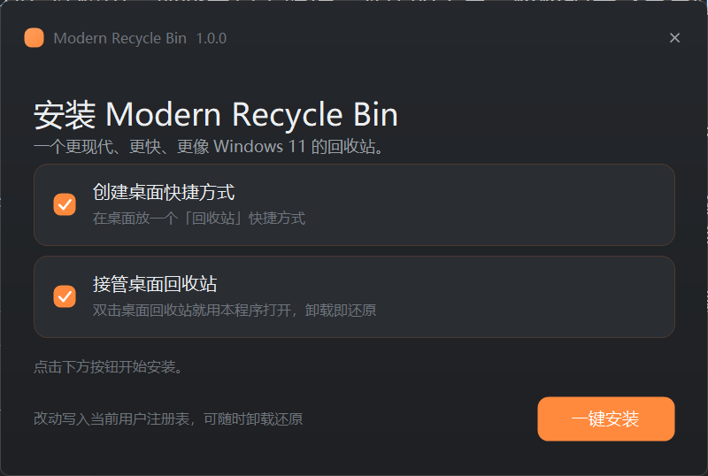
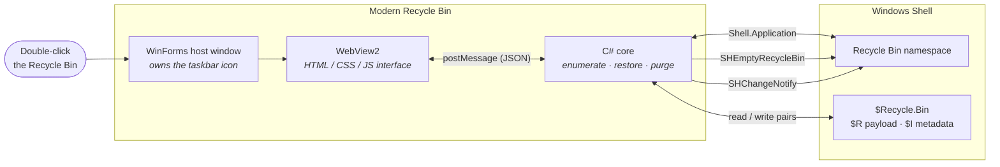

<p align="center">
  
</p>

<p align="center">
  <a href="https://github.com/Dannyzzy/Modern-Recycle-Bin/releases/latest"></a>
  <a href="https://github.com/Dannyzzy/Modern-Recycle-Bin/releases"></a>
  <a href="LICENSE"></a>
  <a href="#requirements"></a>
  <a href="https://github.com/Dannyzzy/Modern-Recycle-Bin/actions/workflows/build.yml"></a>
</p>

<h1 align="center">Modern Recycle Bin</h1>

<p align="center">
  <b>A modern, faster, better Recycle Bin for Windows 11.</b><br/>
  Restore files anywhere, copy them out, preview images — in a native Windows 11 look.
</p>

<h3 align="center">
  <a href="#-installation">Installation</a>
  <span> · </span>
  <a href="#-usage">Usage</a>
  <span> · </span>
  <a href="#-performance">Performance</a>
  <span> · </span>
  <a href="#-how-it-works">How it works</a>
  <span> · </span>
  <a href="#-troubleshooting">Troubleshooting</a>
  <span> · </span>
  <a href="README.zh-CN.md">简体中文</a>
</h3>

---

## 🗑️ What is this?

Windows' built-in Recycle Bin has barely changed in fifteen years. It can only
restore files to the place they came from, it cannot show you what is inside a
file, and it cannot take a copy out without removing the original.

**Modern Recycle Bin** replaces that interface with one written in HTML/CSS and
rendered by WebView2 inside its own window, which makes a real Windows 11 look
achievable — while all the file work still happens in native C# talking to the
shell. It opens in a fraction of a second and keeps the Recycle Bin icon in your
taskbar.

> It is **not** a file manager and it does not touch anything outside the
> Recycle Bin. Installing it is a per-user, two-click operation, and uninstalling
> puts the system default straight back.

## ✨ Features

| | Feature | What it means |
|---|---|---|
| 📂 | **Restore anywhere** | The stock Recycle Bin can only put a file back where it came from. Here you can pick any folder. |
| 📋 | **Copy out** | Copy a file out of the bin and **keep the original where it is** — the stock bin cannot do this at all. |
| 🖼️ | **Image previews** | Select a picture and see a thumbnail on the right, instead of restoring it just to find out what it was. |
| 🎛️ | **Filter by type** | Images / video / audio / documents / archives / code / folders — plus live search over name, original path and type. |
| 🔀 | **Conflict handling** | When a file with the same name already exists, choose **overwrite**, **skip**, or **keep both**. |
| 🌗 | **Windows 11 styling** | Fluent dark theme, 40 px rows, soft rounded hover and selection, smooth motion, comfortable/compact density. |
| ⌨️ | **Built for the keyboard** | `Enter` restore · `Delete` purge · `Ctrl+A` select all · `Ctrl+F` search · `F5` refresh · `Ctrl+0/+/-` zoom. |
| ⚡ | **Instant** | The window appears in about 100 ms and the full list is rendered in about 300 ms. |
| 📌 | **Keeps its icon** | Because the window belongs to this app, the taskbar shows the Recycle Bin icon — never a browser or Explorer icon. |

### Compared with the built-in Recycle Bin

| Capability | Windows built-in | Modern Recycle Bin |
|---|:---:|:---:|
| Restore to the original location | ✅ | ✅ |
| **Restore to a folder you choose** | ❌ | ✅ |
| **Copy a file out, keeping the original** | ❌ | ✅ |
| **Thumbnail preview of images** | ❌ | ✅ |
| Search / filter by file type | ⚠️ limited | ✅ |
| Sort by clicking column headers | ✅ | ✅ |
| Choose how name conflicts are handled | ❌ | ✅ |
| Dark, Windows 11-styled interface | ❌ | ✅ |
| Adjustable row density and zoom | ❌ | ✅ |
| Works without administrator rights | — | ✅ |

## 📸 Screenshots

**The main window.** The details pane on the right shows the picture itself, plus
type, size, original location and timestamps.


**The installer.** A single file, no administrator rights, and every change it
makes can be undone from the same place.

<p align="center">
  
</p>

## 🚀 Installation

### Option A — Installer (recommended)

1. Download **`ModernRecycleBinSetup.exe`** from the
   [latest release](https://github.com/Dannyzzy/Modern-Recycle-Bin/releases/latest).
2. Run it. No administrator rights are required.
3. Tick what you want:
   - **Create a desktop shortcut**
   - **Let the desktop Recycle Bin open with this app** — this writes one
     per-user registry key, and it is completely undone on uninstall.
4. Done. Double-click the Recycle Bin on your desktop to try it.

**To uninstall:** run `Uninstall.cmd` inside the install folder, or
`%LOCALAPPDATA%\ModernRecycleBin-Uninstall.exe`. Uninstalling restores the
default Recycle Bin automatically and removes everything it created.

### Option B — Portable

Download **`ModernRecycleBin-portable.zip`**, unpack it wherever you like, then
run `RecycleBin.exe`. Nothing is written to the registry — delete the folder and
it is gone.

<a name="requirements"></a>
### Requirements

- **Windows 10 or 11, 64-bit**
- **WebView2 Runtime** — preinstalled on Windows 11 and current Windows 10
  builds. If it is missing, the installer says so and links you to Microsoft's
  official download; nothing else is needed.

## 📖 Usage

The interface follows the same mental model as File Explorer, so there is nothing
new to learn:

| Action | How |
|---|---|
| See what a file is | Click it — the details pane fills in, and images show a preview |
| Restore to where it came from | Double-click the row, press `Enter`, or click **Restore** |
| Restore somewhere else | Click **Restore to…** and choose any folder |
| Keep a copy without removing it | Right-click → **Copy to…** |
| Delete permanently | `Delete`, or right-click → **Delete** |
| Empty the whole bin | **Empty Recycle Bin** (the desktop icon updates too) |
| Find something | Type in the search box, or use the **All types** filter |
| Sort | Click any column header, or use the sort button in the toolbar |
| Change rows or text size | **View** → Comfortable / Compact, or hold `Ctrl` and scroll |

**Right-click menu:** Restore · Restore to… · Copy to… · Open original location ·
Properties · Copy original path · Delete permanently.

### How it behaves with Explorer

By default the app only *adds* an entry point: the desktop Recycle Bin opens it,
and the normal empty/full icon state keeps updating because the app tells the
shell whenever the bin changes. Everything else — right-click "Empty Recycle
Bin" on the desktop, deleting files into the bin, Explorer's own Recycle Bin —
keeps working exactly as before.

## ⚡ Performance

Startup was the hardest part to get right. Measured on the development machine
(Windows 11, 125 % display scaling, 22 items in the bin):

| Stage | Time |
|---|---|
| Window visible | **~100 ms** |
| WebView2 controller ready | ~175 ms |
| **Page rendered** | **~300 ms** |

What made that possible, and what was measured along the way:

- **Loading the UI by content, not by URL.** Navigating to a virtual host name
  (`https://something/index.html`) made the WebView walk the full network stack,
  including proxy auto-discovery, which cost **2299 ms**. Passing the HTML
  straight to the control (`NavigateToString`) dropped that to **301 ms** — two
  seconds saved on every launch.
- **Starting the WebView2 runtime in parallel with building the window**, instead
  of after it.
- **No black flash.** The WebView stays hidden until the page has painted, so the
  window shows its own themed background and a brief "Opening Recycle Bin…"
  message instead of a black rectangle while the runtime boots.
- **The list is sent before the icons.** Icons are produced afterwards on a
  dedicated thread and pushed as a second message that patches the rows in place.
  Icons depend on the shell's system image list, which is **not thread-safe** —
  generating them concurrently made most of them fail at random.
- **Full-resolution icons.** Row and details icons come from the shell's 256 px
  (jumbo) image list and are downscaled, rather than upscaling a 16 px icon. The
  window icon is a hand-built **multi-size ICO** (16/32/48/256 plus 20/24/40,
  which DPI scaling actually asks for), so the title bar is never resampled.
- **The desktop icon can no longer go stale.** The bin is modified by writing the
  `$R`/`$I` pairs directly, so the app verifies every deletion, sweeps up orphaned
  metadata, and empties through `SHEmptyRecycleBin` — the only way Explorer's
  desktop icon follows along.

## 🔧 How it works



**Where each part lives**

| File | Role |
|---|---|
| `src/RbWeb.cs` | The host: window, WebView2 setup, shell access, all file operations |
| `src/ui/index.html` | The whole interface — layout, styling and interaction |
| `installer/Setup.cs` | The single-file installer and uninstaller |
| `lib/` | Microsoft's official WebView2 SDK (`net462` build + x64 native loader) |

**Why the UI is HTML.** Getting a genuinely Windows 11 look out of classic
WinForms controls means owner-drawing every pixel — and even then the list
selection is a fixed system blue that cannot be restyled. HTML and CSS give the
real thing: correct type sizes, sub-pixel text rendering, rounded surfaces and
Fluent motion.

**Why the host is our own window.** Hosting the same UI in a browser would hand
the taskbar a browser icon. Because the WebView lives inside a WinForms window
belonging to this application, the taskbar and Alt-Tab show the Recycle Bin icon.

**Why the file operations are native C#.** Reading `$Recycle.Bin` directly means
the app knows exactly what it is doing: it parses the `$I` metadata for the
original path and deletion time, pairs it with the `$R` payload, and verifies
every move. It never shells out to a verb that might block on an invisible
dialog.

## 🛠️ Building from source

You need nothing but the .NET Framework compiler that ships with Windows.

```cmd
git clone https://github.com/Dannyzzy/Modern-Recycle-Bin.git
cd Modern-Recycle-Bin
build.cmd
```

The script compiles `src/RbWeb.cs`, assembles the portable build, and produces all
three release artefacts in `dist/`:

```
dist\RecycleBin.exe                  portable application
dist\ModernRecycleBinSetup.exe       single-file installer
dist\ModernRecycleBin-portable.zip   portable zip
```

A GitHub Actions workflow (`.github/workflows/build.yml`) runs the same script on
every push.

## ❓ Troubleshooting

<details>
<summary><b>The window is blank, or says WebView2 is missing</b></summary>

The app renders its interface with the WebView2 Runtime. Windows 11 and current
Windows 10 include it. If it is absent, install Microsoft's official Evergreen
Bootstrapper and run the app again:
<https://go.microsoft.com/fwlink/p/?LinkId=2124703>
</details>

<details>
<summary><b>Windows SmartScreen warns me about the installer</b></summary>

The release binaries are not code-signed (a signing certificate costs money for
an open-source project). Choose **More info → Run anyway**. You can also build
the binaries yourself with `build.cmd` and use those.
</details>

<details>
<summary><b>Does this delete anything by itself?</b></summary>

No. The app never touches anything outside the Recycle Bin, and it never empties
or deletes without a confirmation dialog. Restoring moves files back to their
original location; deleting removes them permanently, exactly as the system
Recycle Bin would.
</details>

<details>
<summary><b>How do I get the default Recycle Bin back?</b></summary>

Run `Uninstall.cmd` in the install folder. It removes the per-user registry
redirect, deletes the desktop shortcut, and deletes the program folder. The
desktop Recycle Bin immediately behaves as it originally did.
</details>

<details>
<summary><b>Why can't I cut a file?</b></summary>

Inside `$Recycle.Bin` a file is stored under an internal `$R…` name. A home-made
cut would put that internal name on the clipboard and paste it under the wrong
name. Explorer can do it because the shell handles the copy itself — so this app
deliberately offers restore and copy-out instead.
</details>

## 🧭 Known limitations

- **No "Cut".** See the explanation above.
- **Items the current user cannot read** (for example another account's bin) are
  skipped, and the app reports them rather than failing silently.
- **Videos are not previewed.** Only images get a thumbnail, by design.
- The interface is currently **Simplified Chinese**; English strings are on the
  way.

## 🤝 Contributing

Issues and pull requests are welcome. If you have found a bug, please include
your Windows version, the steps to reproduce it, and — when relevant — what the
Recycle Bin contained at the time.

## 📄 License

Released under the [MIT License](LICENSE).

Bundled third-party components and their licenses are listed in
[THIRD-PARTY-NOTICES.md](THIRD-PARTY-NOTICES.md). No files from Windows, Explorer
or any third-party application are redistributed; the Recycle Bin icon is read
from the system at runtime.

## 🔗 See also

**[Files Companion](https://github.com/Dannyzzy/Files-Companion)** — brings the
startup animation back to the [Files](https://github.com/files-community/Files)
file manager and routes folders, drives, "This PC" and `Win+E` through it. Its
installer can set up this Recycle Bin for you in the same pass, so the two work
as one set.
