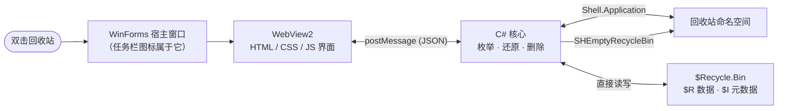

# Modern Recycle Bin

**一个更现代、更快、更好用的 Windows 回收站。**

用 WebView2 + HTML/CSS 重写界面，观感与 Windows 11 一致；文件操作仍由原生 C# 直接与系统交互。
窗口约 100 毫秒出现、完整列表约 300 毫秒渲染，并且**任务栏图标始终是回收站图标**。

> English README: [README.md](README.md)


## 它解决了什么

系统自带的回收站有这些长期存在的问题：

| 系统回收站 | Modern Recycle Bin |
|---|---|
| ❌ 只能还原到**原位置** | ✅ **还原到…**：自选任意文件夹 |
| ❌ 不能把文件**复制出来** | ✅ **复制到…**：复制一份，原件保留 |
| ❌ 看不到内容，只能猜 | ✅ **图片缩略图预览** |
| ❌ 不能按类型筛选 | ✅ **按类型筛选** + 实时搜索 |
| ❌ 界面是十年前的样式 | ✅ **Windows 11 风格**（暗色、圆角、动效）|
| ❌ 同名冲突处理含糊 | ✅ **覆盖 / 跳过 / 保留两者** |

## 安装

**方式一：一键安装（推荐）**

到 [Releases](https://github.com/Dannyzzy/Modern-Recycle-Bin/releases/latest) 下载
`ModernRecycleBinSetup.exe`，双击运行即可 —— **不需要管理员权限**。

可以勾选：创建桌面快捷方式、让桌面上的「回收站」用它打开（写入当前用户注册表，卸载自动还原）。

**方式二：绿色便携版**

下载 `ModernRecycleBin-portable.zip`，解压后直接运行 `RecycleBin.exe`，不写注册表。

**卸载**：运行安装目录里的 `Uninstall.cmd`，桌面回收站会自动恢复为系统默认。

## 使用

| 操作 | 方法 |
|---|---|
| 看文件是什么 | 单击选中，右侧显示详情；图片会显示缩略图 |
| 还原到原位置 | 双击该行 / `Enter` / 点「还原」 |
| 还原到别处 | 点「还原到…」选文件夹 |
| 复制出来但保留原件 | 右键 →「复制到…」 |
| 永久删除 | `Delete` 或右键 →「删除」 |
| 清空回收站 | 点「清空回收站」（桌面图标会同步更新）|
| 查找 | 搜索框，或「全部类型」筛选 |
| 排序 | 点列头，或用工具栏的排序按钮 |
| 调整行距/字号 | 「查看」→ 舒适/紧凑，或 `Ctrl` + 滚轮 |

**右键菜单**：还原 · 还原到… · 复制到… · 打开原位置 · 属性 · 复制原路径 · 永久删除。

## 性能

在开发机（Windows 11、125% 缩放、22 个项目）实测：

| 阶段 | 耗时 |
|---|---|
| 窗口出现 | **约 100 毫秒** |
| 页面渲染完成 | **约 300 毫秒** |

关键优化：

- **按内容加载界面，而不是按网址** —— 用虚拟域名加载会让 WebView 走完整网络栈（触发代理自动发现），实测白白多花 **2299 毫秒**；改为直接注入 HTML 后降到 **301 毫秒**
- **WebView2 运行时与窗口创建并行启动**
- **没有黑屏** —— 页面渲染完成前 WebView 保持隐藏，显示主题背景与「正在打开回收站…」
- **列表先发、图标后发** —— 系统图标列表不是线程安全的，并发取图会随机失败
- **图标取 256px 高清源**再缩小；窗口图标自建多尺寸 ICO（含 20/24/40 等 DPI 对应尺寸）
- **桌面图标不会失效** —— 每次操作都校验、清理孤儿元数据，并用 `SHEmptyRecycleBin` 清空

## 架构



## 从源码构建

只需要 Windows 自带的 .NET Framework 编译器：

```cmd
git clone https://github.com/Dannyzzy/Modern-Recycle-Bin.git
cd Modern-Recycle-Bin
build.cmd
```

产物在 `dist/`：便携版主程序、单文件安装器、便携版 zip。

## 系统要求

- Windows 10 / 11（64 位）
- WebView2 运行时（Windows 11 已内置；缺失时安装器会提示并给出官方下载链接）

## 已知限制

- 不提供「剪切」：回收站内文件是 `$R` 内部名，自行实现会粘出错误的文件名
- 当前用户无权限读取的项目会被跳过并如实报告
- 视频不做预览（仅图片）
- 界面目前为简体中文，英文界面在计划中

## 许可证

[MIT](LICENSE) · 第三方组件见 [THIRD-PARTY-NOTICES.md](THIRD-PARTY-NOTICES.md)